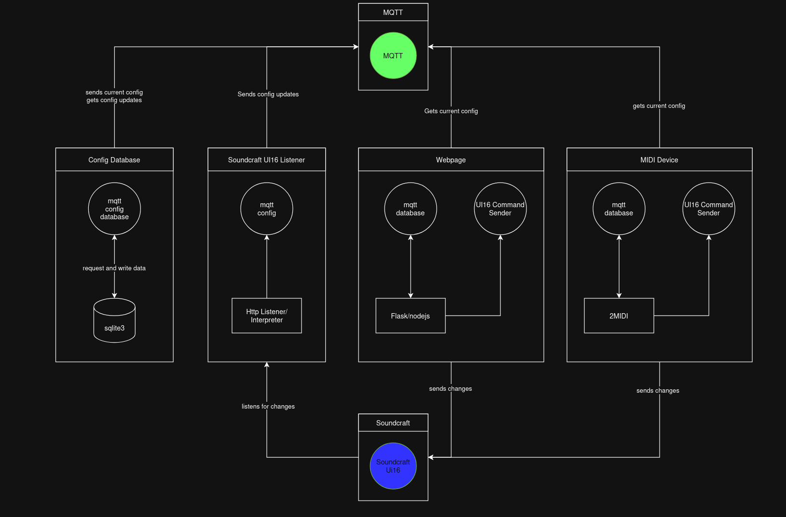

# Soundcraftui16mqtt

This is a library to create a connection between soundcraft ui16 and some information consumer and producer using a mqtt server as message bus for all components.

# Example
## Basic
The simplest configuration would be:
```
from soundcraftui16mqtt_database import DatabaseMqttController
from soundcraftui16mqtt_listeners import DatabaseMqttListener
from soundcraftui16mqtt_mixer import MixerListener

mqtt_host = "localhost" # "127.0.0.1" or some other address
mqtt_port = 1883

controller = DatabaseMqttController(mqtt_host, mqtt_port)
listener = DatabaseMqttListener(mqtt_host, mqtt_port)
mixer_listener = MixerListener("10.10.2.1", "80", mqtt_host, mqtt_port)
controller.start()
listener.start()
mixer_listener.start()
```

This will create a sqlite3 database at `/opt/mididatabase/config.db` and connect all three components to  the mqtt server at `localhost:1883`.

The Mixer Listener will format and send soundcraft ui16 messages to topic `config/#`.

This will be read by the controller and information will be stored in the database.

listener clients can now request updates on topic `database_request/{client_id}/#` and will be served with data from database on topic `database_update/{client_id or all}/#`.

## Webpage
Webapp can be started using gunicorn to deploy the flask server.
```
interface_ip="127.0.0.1"
web_port=5000
mqtt_host="localhost"
mqtt_port=9001 # websocket mqtt port for js mqtt client

gunicorn -w 1 -b $interface_ip:$web_port 'soundcraftui16mqtt_web:get_webapp("{mqtt_host}", {mqtt_port})'
```

# Communication idea
[](docs/idea.png)
